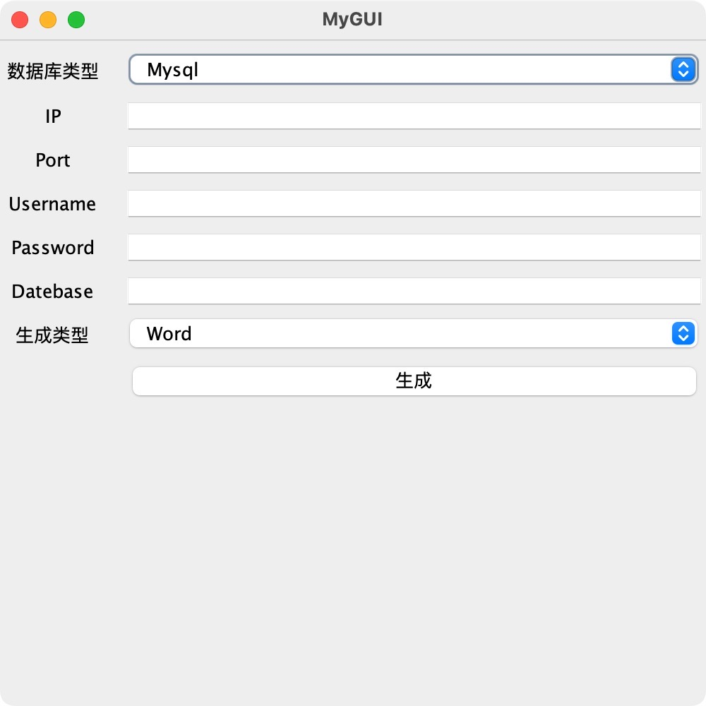
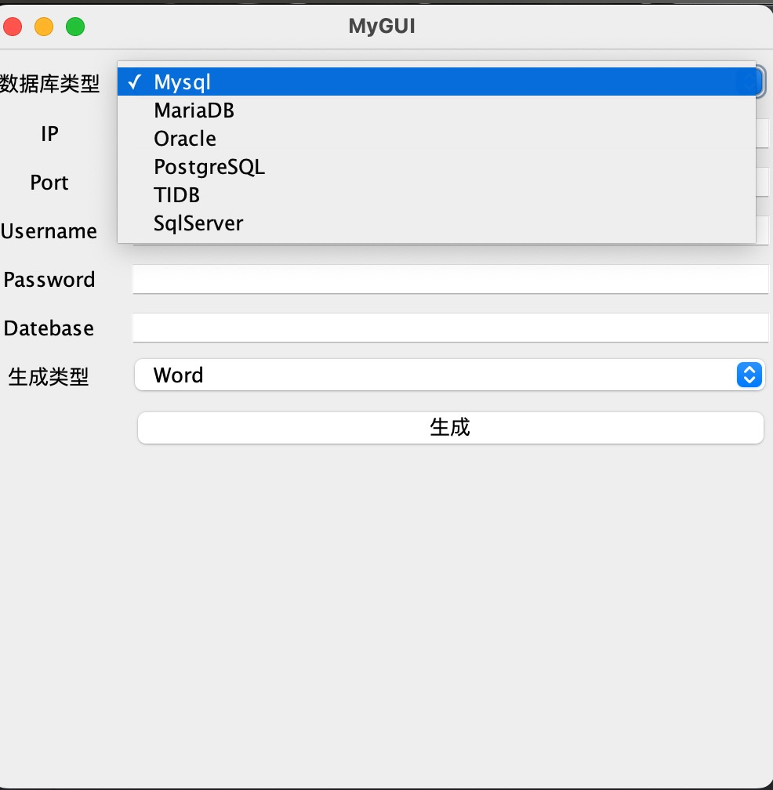
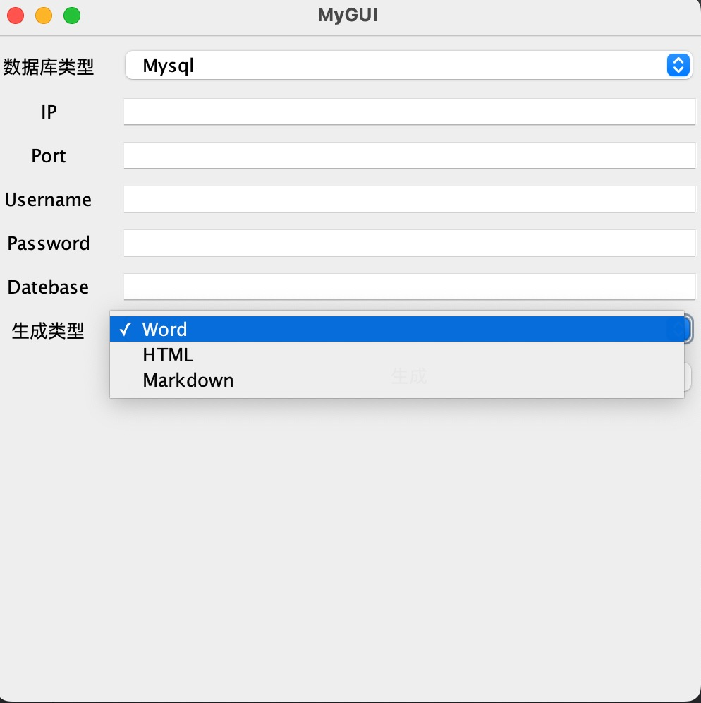

# 描述
因为最近需要编写数据库表结构文档,于是基于`swing`和 [screw](https://github.com/pingfangushi/screw) 做了GUI版本的生成文档小工具

GUI方式的数据库生成文档，降低了门槛，运维人员和产品经理也可以轻松生成使用

- 启动环境: 需要安装 jdk1.8+ 
- 支持数据库类型: Mysql,MariaDB,TIDB,Oracle,SqlServer,PostgreSQL
- 支持生成文档类型: Word、Html、Markdown
- 启动方式: 双击jar启动 

# 如何打包
`mvn package` 会生成`db2doc.jar` 和 `db2doc-jar-with-dependencies.jar`

后者可以双击运行

# 贡献
- [screw](https://github.com/pingfangushi/screw) 感谢大佬开发的生成工具
